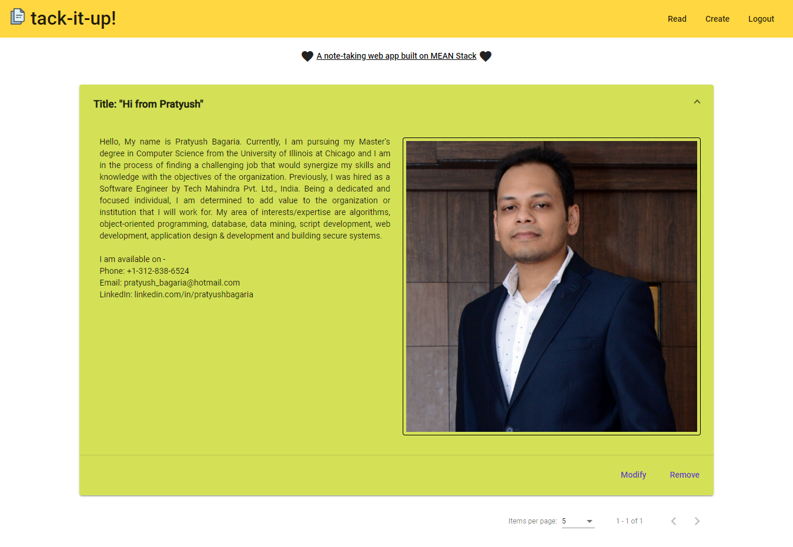

## tack-it-up! [A MEAN Stack App]

### About the project
`tack-it-up` is a web application built on MEAN Stack viz. MongoDB, Express.js, Angular.js and Node.js. This app is basically a note-taking app which supports secure sign-up and login/logout features and all the notes/posts by the user are publicly readable by any visitor to the website. However functionality is implemented as such that the note/post can be modified or removed by the user who created it. Errors are handled efficiently while password encryption is in place to manage user accounts. For styling, Angular Material is used extensively.

### Changes required before building the project
1. Rename the folder to `mean-project` after cloning and unzipping
2. Create a cluster on mongodb atlas (cloud db of mongodb), a database named `mean-project` in that cluster and two collections named `posts` and `users` in that database. Make sure to IP whitelist for all IP address for this cluster
3. Copy the SRV Connection String for this cluster which should something like this: `mongodb+srv://prats:<PASSWORD>@cluster0-gitbh.mongodb.net/test?retryWrites=true`
4. Remove `?retryWrites=true` and in place of `<PASSWORD>` type-in `" + process.env.DB_PSWRD + "`, simultaneously add this `<PASSWORD>` in `nodemon.json` available in `src` folder while replacing the contents for `DB_PSWRD` key there
5. Navigate to `backend/app.js` file and replace this path in line 13

### Execution steps to build and run from command line
1. issue `ng serve` to build or compile the code on terminal window. Do not close this terminal window.
2. issue `npm run start:server` in another terminal window to establish connection to the database.
3. navigate to http://localhost:4200/ on your browser to see the app runnning.

### External packages required

 - bcryptjs : 2.4.3
 - body-parser : 1.18.3
 - express : 4.16.4
 - jsonwebtoken : 8.4.0
 - mongoose : 5.3.13
 - mongoose-unique-validator : 2.0.2
 - multer : 1.4.1
 - rxjs : 6.3.3

### Demo Link & Screenshot

The app is deployed on AWS using its S3 and Elastic Beanstalk service. [Click here](http://tack-it-up.s3-website-us-east-1.amazonaws.com) to give it a try. Application's `logged-in state` is shown below:

